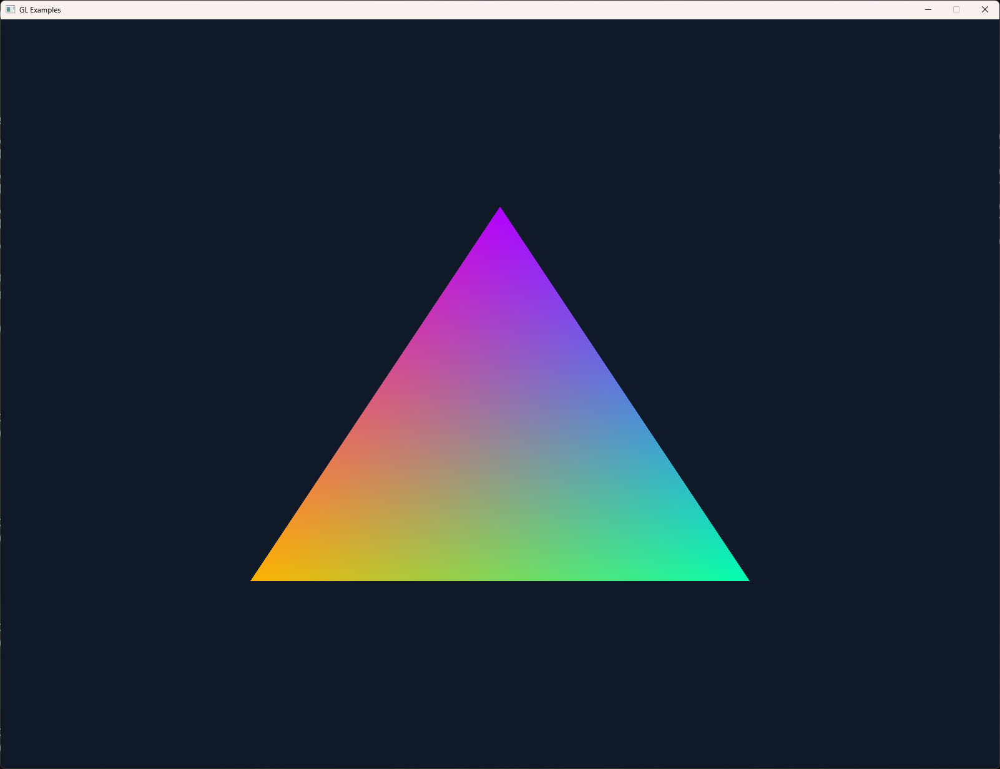
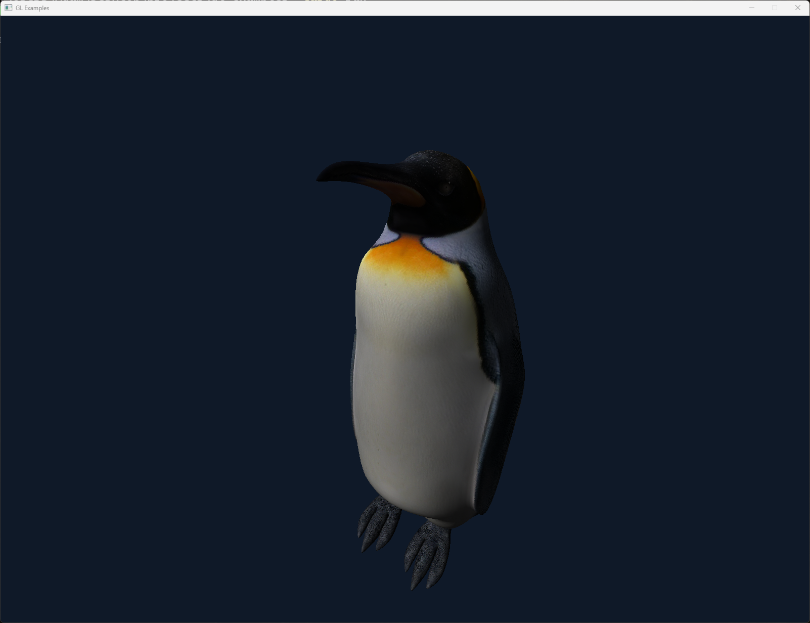

# gl-examples

### A very bare-bones OpenGL project to demonstrate OpenGL 4.6 in Rust.

Uses the 'glfw' and 'gl' crates to allow direct overloading of the modern GL functions. When I first tried learning OpenGL with Rust, every example I could find either used higher-level abstracted crates like 'glutin' and 'glium' or were limited to OpenGL 3.3.

This example is meant to be a readable example of interfacing directly with OpenGL 4.6 from Rust and building safe wrappers for all of the external functions.

### Hello, Triangle

### Hello, Penguin

I used C++ originally to get started with OpenGL, but I would have much rather used Rust. However, both Rust extern-functions and OpenGL have a lot of quirks, and it would have been too taxxing to deal with both. Hopefully someone can use this as a way to alleviate some of the Rust-sided difficulties so they can focus on the GL API stuff.

## Resources:
- https://learnopengl.com/
- https://github.com/livinamuk/GLExamples
- https://docs.rs/glfw/latest/glfw/
- https://docs.rs/gl/latest/gl/
